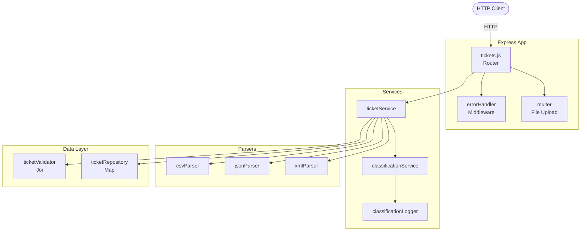

# 🏦 Homework 2: Intelligent Customer Support System

> **Student Name**: Iryna Balandiukh
> **Date Submitted**: 04.05.2026
> **AI Tools Used**: Claude Code

---

## 📋 Project Overview

A REST API built with Node.js and Express for managing customer support tickets. Key features include multi-format bulk import (CSV, JSON, XML via `POST /tickets/import`), a keyword-based auto-classification engine that assigns category and priority with a confidence score, full CRUD with query-string filtering, Joi validation on all inputs, and an in-memory repository backed by a UUID-keyed Map. The project ships with 8 Jest test files (unit, integration, and performance) achieving >85% code coverage.

---

## 🏗️ Architecture



---

## 📁 Project Structure

```
homework-2/
├── src/
│   ├── app.js                          # Express app factory
│   ├── server.js                       # Entry point (calls listen)
│   ├── routes/
│   │   └── tickets.js                  # 7 REST endpoints
│   ├── services/
│   │   ├── ticketService.js            # CRUD orchestration
│   │   └── classificationService.js    # Keyword-based classifier
│   ├── repositories/
│   │   └── ticketRepository.js         # In-memory Map store
│   ├── validators/
│   │   └── ticketValidator.js          # Joi schema
│   ├── parsers/
│   │   ├── csvParser.js                # CSV stream parser
│   │   ├── jsonParser.js               # JSON parser (root array / envelope)
│   │   └── xmlParser.js                # XML parser
│   ├── middleware/
│   │   └── errorHandler.js             # Centralized error handler
│   └── utils/
│       └── classificationLogger.js     # Structured JSON logger
├── tests/
│   ├── test_ticket_api.test.js         # API endpoint tests (23)
│   ├── test_ticket_model.test.js       # Validator & repo tests (13)
│   ├── test_categorization.test.js     # Classification tests (10)
│   ├── test_import_csv.test.js         # CSV parser tests (6)
│   ├── test_import_json.test.js        # JSON parser tests (5)
│   ├── test_import_xml.test.js         # XML parser tests (5)
│   ├── test_integration.test.js        # End-to-end tests (6)
│   ├── test_performance.test.js        # Performance benchmarks (5)
│   └── fixtures/
│       ├── sample_tickets_valid.csv
│       ├── sample_tickets_valid.json
│       ├── sample_tickets_valid.xml
│       └── …_invalid.* files
├── docs/
│   ├── PLAN.md                         # Implementation plan
│   └── screenshots/
├── CLAUDE.md                           # Claude Code guidance
├── API_REFERENCE.md                    # Full API documentation
├── ARCHITECTURE.md                     # Technical architecture
├── TESTING_GUIDE.md                    # Test instructions & manual checklist
├── HOWTORUN.md                         # Quick-start & demo scripts
├── jest.config.js                      # Jest configuration
├── package.json
└── package-lock.json
```

---

## 📚 Documentation

- **[HOWTORUN.md](./HOWTORUN.md)** — Detailed setup and demo scripts
- **[API_REFERENCE.md](./API_REFERENCE.md)** — All endpoints with cURL examples, schemas, and error codes
- **[ARCHITECTURE.md](./ARCHITECTURE.md)** — System design, component descriptions, and data flow diagrams
- **[TESTING_GUIDE.md](./TESTING_GUIDE.md)** — How to run tests and manual testing checklist
- **[CLAUDE.md](./CLAUDE.md)** — Guidance for AI code assistants

<div align="center">

_This project was completed as part of the AI-Assisted Development course._

</div>
