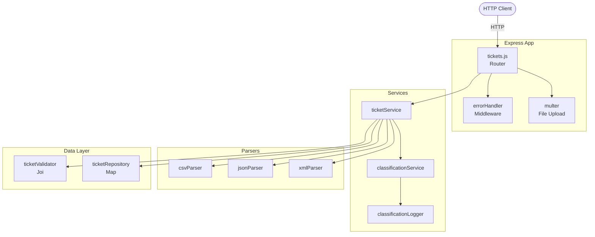
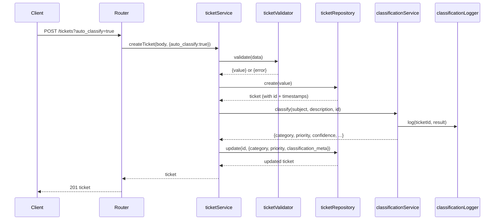
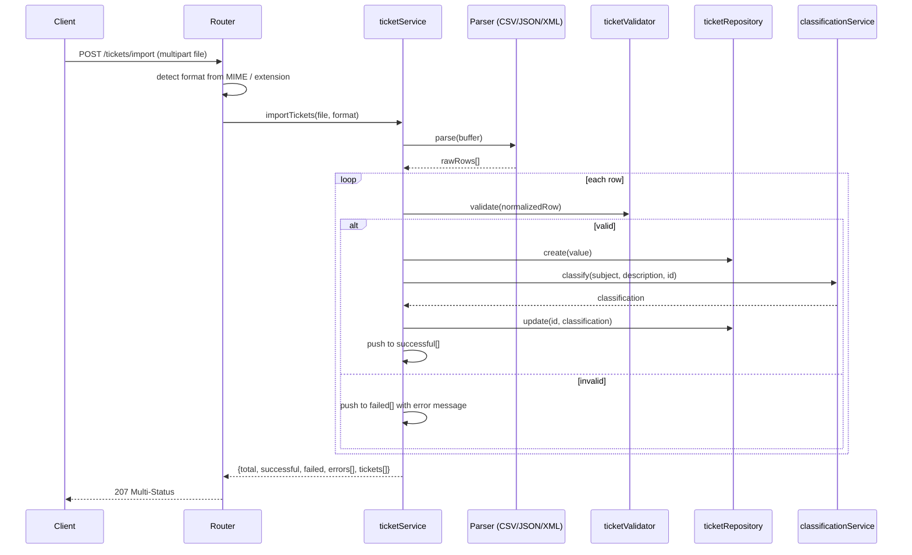

# Architecture

## Overview

Intelligent Customer Support Ticket System — a stateless Node.js/Express REST API backed by an in-memory store. All ticket data lives in a single-process `Map`; there is no external database or network dependency.

---

## High-Level Component Diagram

---

## Request Lifecycle

### Ticket Creation with Auto-Classification

### Bulk Import Flow

---

## Component Descriptions

| Component | File | Responsibility |
|---|---|---|
| Router | `src/routes/tickets.js` | Maps HTTP verbs/paths to service calls; handles file upload via multer |
| ticketService | `src/services/ticketService.js` | Orchestrates validation, repository operations, classification, and import pipeline |
| classificationService | `src/services/classificationService.js` | Pure keyword-matching function; no side effects except logging |
| classificationLogger | `src/utils/classificationLogger.js` | Emits structured JSON to stdout for each classification event |
| ticketRepository | `src/repositories/ticketRepository.js` | In-memory `Map`; assigns UUID v4 and ISO-8601 timestamps on create; exposes `clear()` for tests |
| ticketValidator | `src/validators/ticketValidator.js` | Joi schema for full create and partial update; defaults `category: other`, `priority: medium`, `status: new` |
| csvParser | `src/parsers/csvParser.js` | Wraps buffer in a `Readable` stream and pipes through `csv-parser` |
| jsonParser | `src/parsers/jsonParser.js` | Accepts root array or `{tickets:[]}` envelope |
| xmlParser | `src/parsers/xmlParser.js` | Uses `xml2js`; normalises single-child arrays to avoid object collapsing |
| errorHandler | `src/middleware/errorHandler.js` | Final Express middleware; normalises all errors to `{error, message, details}`; hides stack in production |

---

## Classification Engine

The engine is intentionally simple and fully deterministic — no ML, no external calls.

**Category** is chosen by counting keyword matches across five dictionaries and selecting the winner. A tie goes to whichever dictionary appears first in the iteration order. If no keywords match, `other` is returned.

**Priority** is evaluated by scanning for `urgent` → `high` → `low` keywords in that order; the first match wins. Unmatched tickets get `medium`.

**Confidence** = `min(matchCount / 5, 1.0)` — saturates at five category keyword matches.

---

## Design Decisions

**In-memory storage.** No persistence between restarts. Chosen to keep the project dependency-free and fully self-contained. `ticketRepository.clear()` makes test isolation trivial.

**207 Multi-Status for import.** A bulk import can partially succeed. Returning 207 lets the client distinguish "all failed" from "some failed" without having to inspect a body flag.

**Multer memory storage.** Files are held as `Buffer` objects — never written to disk — keeping the API stateless and deployment-friendly.

**Centralised error handler.** All errors flow through `src/middleware/errorHandler.js`. Route handlers only need to `next(err)` with `err.statusCode` set; the middleware owns the response shape.

**CSV streaming.** The CSV parser wraps the buffer in a `Readable` stream rather than loading the whole string, keeping memory usage flat for large files.

---

## Security Considerations

- File uploads are capped at **5 MB** by multer.
- All input is validated against a strict Joi schema before touching the repository.
- `id`, `created_at` are server-assigned and cannot be supplied by clients on create.
- Stack traces are omitted when `NODE_ENV=production`.
- No authentication layer — intended for internal/trusted networks only.

---

## Performance Characteristics

| Operation | Complexity | Benchmark |
|---|---|---|
| `findById` | O(1) | — |
| `findAll` with filters | O(n) | 500 items < 100 ms |
| `classify` | O(k) k = total keywords | 1 000 calls < 200 ms |
| Sequential creates (×100) | O(n) | < 500 ms |
| CSV import (50 rows) | O(n) | < 1 000 ms |
| 20 concurrent POSTs | — | all succeed |
