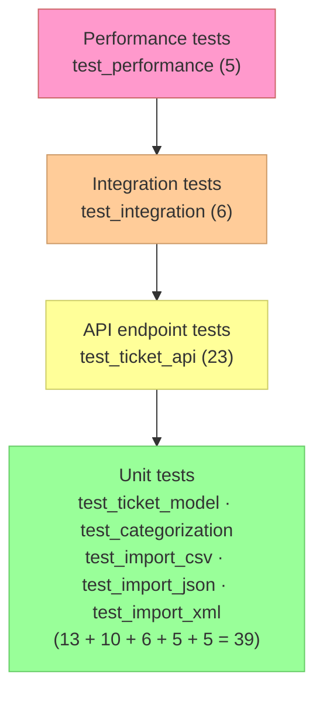

# Testing Guide

## Test Pyramid



---

## Running Tests

```bash
# Full suite with coverage report
npm test

# Watch mode (re-runs on file save)
npm run test:watch

# Single test file
npx jest tests/test_ticket_api.test.js

# Filter by test name
npx jest -t "auto-classify"
npx jest -t "CSV"

# Two files in parallel
npx jest tests/test_import_csv.test.js tests/test_import_json.test.js
```

Coverage is written to `coverage/` after `npm test`. Open `coverage/lcov-report/index.html` in a browser for the HTML report.

**Coverage threshold:** 85% statements, branches, functions, and lines. The suite fails if any metric drops below this. `src/server.js` is excluded.

---

## Test File Map

| File | Scope | Count |
|---|---|---|
| `tests/test_ticket_api.test.js` | HTTP endpoints via supertest — create, read, update, delete, import, auto-classify, filters, error handling | 23 |
| `tests/test_ticket_model.test.js` | Joi validator, repository operations, service error paths | 13 |
| `tests/test_categorization.test.js` | Classification categories, priorities, confidence bounds, keyword detection | 10 |
| `tests/test_import_csv.test.js` | CSV parser — row count, required fields, empty input, stream errors | 6 |
| `tests/test_import_json.test.js` | JSON parser — root array, envelope format, malformed input, empty array | 5 |
| `tests/test_import_xml.test.js` | XML parser — ticket count, single-child guard, malformed XML, missing root | 5 |
| `tests/test_integration.test.js` | Full lifecycle, bulk import + auto-classify, concurrent requests, combined filters | 6 |
| `tests/test_performance.test.js` | Time-bounded benchmarks | 5 |

---

## Fixtures

Located in `tests/fixtures/`.

| File | Contents |
|---|---|
| `sample_tickets_valid.csv` | 10 well-formed rows |
| `sample_tickets_invalid.csv` | Rows with missing/malformed fields |
| `sample_tickets_valid.json` | 5 ticket objects (root array) |
| `sample_tickets_invalid.json` | Mix of valid and invalid objects |
| `sample_tickets_valid.xml` | 5 `<ticket>` elements |
| `sample_tickets_invalid.xml` | Elements with validation errors |

---

## Test Isolation

Each test file clears the in-memory repository in `beforeEach`:

```js
const ticketRepository = require('../src/repositories/ticketRepository');
beforeEach(() => ticketRepository.clear());
```

Tests are fully hermetic — no shared state, no network calls, no file system writes.

---

## Manual Testing Checklist

Use these steps to verify the running server manually with cURL or a tool like Postman.

### Ticket CRUD

- [ ] `POST /tickets` with all required fields → `201` with `id`, `created_at`, `updated_at`
- [ ] `POST /tickets` missing `customer_email` → `400` with `details` array
- [ ] `POST /tickets` with invalid email → `400`
- [ ] `POST /tickets?auto_classify=true` → ticket contains `classification_meta`
- [ ] `GET /tickets` → array (may be empty)
- [ ] `GET /tickets/:id` with valid id → `200` ticket
- [ ] `GET /tickets/:id` with unknown id → `404`
- [ ] `PUT /tickets/:id` change `status` to `in_progress` → `200` updated ticket
- [ ] `PUT /tickets/:id` with unknown id → `404`
- [ ] `DELETE /tickets/:id` → `204` no body
- [ ] `DELETE /tickets/:id` again → `404`

### Filtering

- [ ] `GET /tickets?status=new` → only `new` tickets
- [ ] `GET /tickets?priority=urgent&category=technical_issue` → combined filter
- [ ] `GET /tickets?customer_id=cust-001` → only that customer's tickets

### Bulk Import

- [ ] Import `sample_tickets_valid.csv` → `207`, `failed: 0`
- [ ] Import `sample_tickets_invalid.csv` → `207`, `failed > 0`, `errors` populated
- [ ] Import `sample_tickets_valid.json` → `207`, all tickets auto-classified
- [ ] Import `sample_tickets_valid.xml` → `207`
- [ ] Upload `.txt` file → `400` unsupported format
- [ ] POST without file → `400` no file provided

### Auto-Classification

- [ ] `POST /tickets/:id/auto-classify` → `200` with `category`, `priority`, `confidence`, `keywords_found`
- [ ] Ticket in store now has updated `category`, `priority`, `classification_meta`

---

## Performance Benchmarks

These are enforced by `tests/test_performance.test.js`.

| Scenario | Limit |
|---|---|
| 100 sequential `POST /tickets` | < 500 ms |
| `GET /tickets` with 500 items in store | < 100 ms |
| 20 concurrent `POST /tickets` | all succeed (no errors) |
| 1 000 `classify()` calls (in-process) | < 200 ms |
| Bulk import of 50-row CSV | < 1 000 ms |
